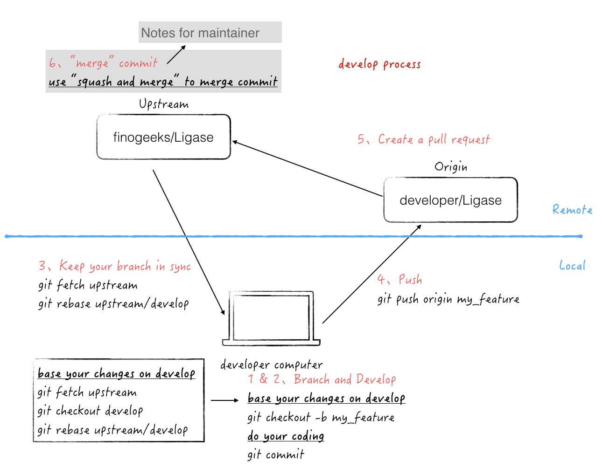

# Overview

Ligase is a community driven open source project and we welcome any contributor!

If you think something should be changed or added, please open an issue to discuss the change. You can open a PR if you want to be explicit about the change, but the change may need extensive discussion and possibly revision before it is accepted.

Feedback is welcome, feel free to open issue for any problem

# Development Environment

[How to Write Go Code](http://golang.org/doc/code.html)

Ligase use [`Go Modules`](https://github.com/golang/go/wiki/Modules) to manage dependencies

The version of GO should be **1.13** or above

# Style Guide

Working with our source code involves some famous rules:

[Effective GO](https://golang.org/doc/effective_go.html)

[Go Code Review Comments](https://github.com/golang/go/wiki/CodeReviewComments)

# Workflow

## Setup process

### step 1: Fork in the cloud

1. Visit https://github.com/finogeeks/ligase
2. On the top right of the page, click the `Fork` button (top right) to create a cloud-based fork of the repository.

### step 2: Clone fork to local storage

```sh
mkdir -p $working_dir
cd $working_dir
git clone https://github.com/$user/ligase.git
# or: git clone git@github.com:$user/ligase.git

cd $working_dir/ligase
git remote add upstream https://github.com/finogeeks/ligase.git
# or: git remote add upstream git@github.com:finogeeks/ligase.git

# Confirm that your remotes make sense:
# It should look like:
# origin    git@github.com:$(user)/ligase.git (fetch)
# origin    git@github.com:$(user)/ligase.git (push)
# upstream  https://github.com/finogeeks/ligase (fetch)
# upstream  https://github.com/finogeeks/ligase (push)
git remote -v
```

## Develop process

The overview of develop process is as follows:



### step 1: Branch

```sh
cd $working_dir/ligase
# Keep your branch in sync
git fetch upstream
git checkout develop
git rebase upstream/develop
```

Branch from develop:

```sh
git checkout -b my_feature
```

### Step 2: Develop
#### Edit the code

You can now edit the code on the `my_feature` branch.

#### Build && Run Ligase
```sh
# start up the dependency services
docker-compose up -d

# build
./build.sh

# run the server
./run.sh

```
#### Test

```sh

# build and run the unit test to make sure all tests are passed.
make test

# Check the checklist (gofmt -> golint)
make checklist

```

#### commit

Commit your changes.

```sh
git commit
```

Likely you'll go back and edit/build/test further, and then `commit --amend` in a
few cycles.

### Step 3: Keep your branch in sync

```sh
# While on your myfeature branch.
git fetch upstream
git rebase upstream/develop
```

Please don't use `git pull` instead of the above `fetch`/`rebase`. `git pull`
does a merge, which leaves merge commits. These make the commit history messy
and violate the principle that commits ought to be individually understandable
and useful (see below). You can also consider changing your `.git/config` file
via `git config branch.autoSetupRebase` always to change the behavior of `git pull`.

### Step 4: Push

When the changes are ready to review (or you just to create an offsite backup
or your work), push your branch to your fork on `github.com`:

```sh
git push origin my_feature
# or: git push --set-upstream ${your_remote_name} my_feature
```

### Step 5: Create a pull request

1. Visit your fork at `https://github.com/$user/ligase`.
2. Click the `Compare & Pull Request` button next to your `my_feature` branch.
3. Fill in the required information in the PR template.

#### Get a code review

If your pull request (PR) is opened, it will be assigned to one or more
reviewers. Those reviewers will do a thorough code review, looking at
correctness, bugs, opportunities for improvement, documentation and comments,
and style.

To address review comments, you should commit the changes to the same branch of
the PR on your fork

# Notes for maintainers on merging PRs etc

There are some notes for those with commit access to the project on how we manage git [here](./docs/dev/git/git.md).

