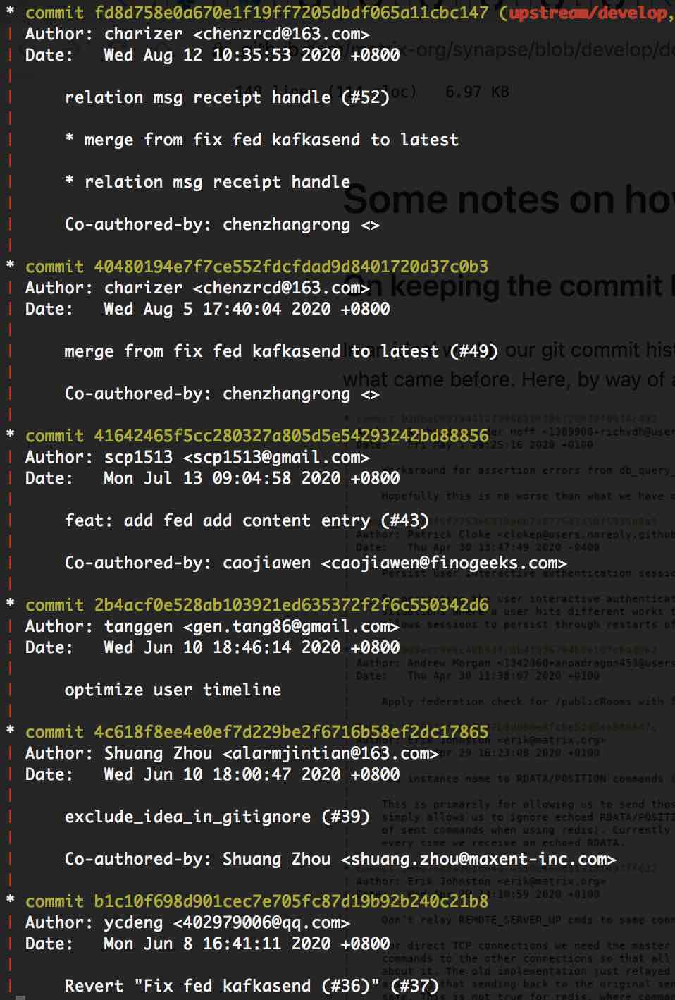
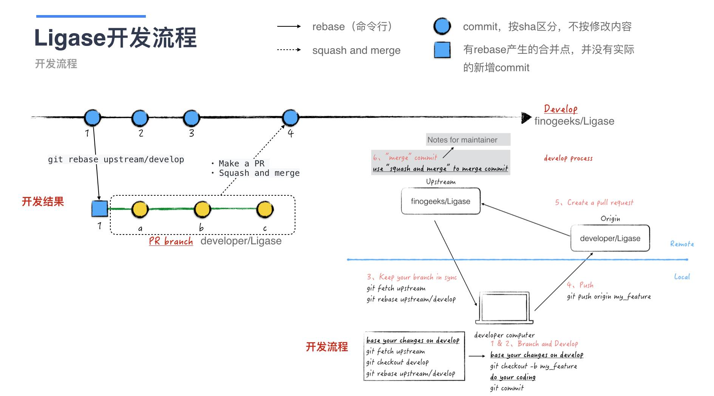
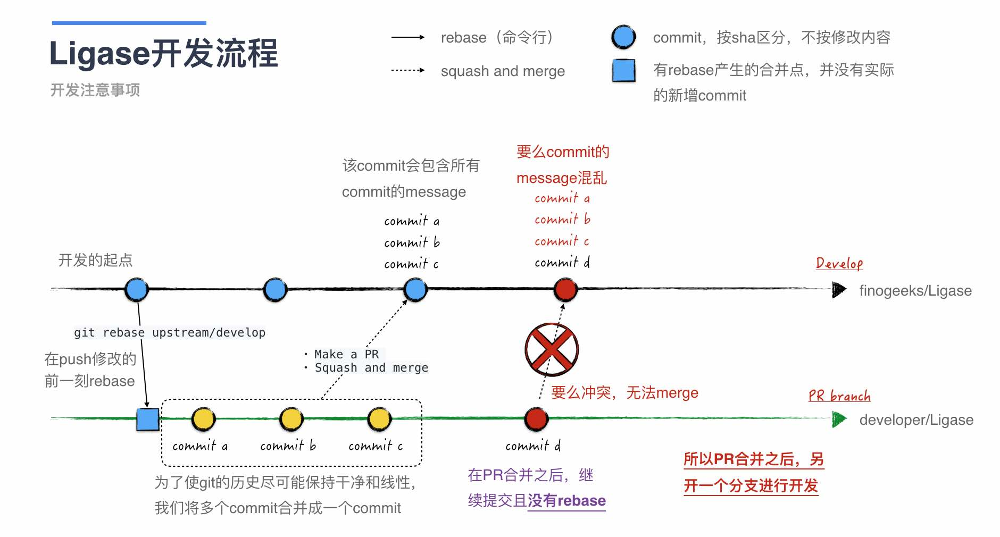
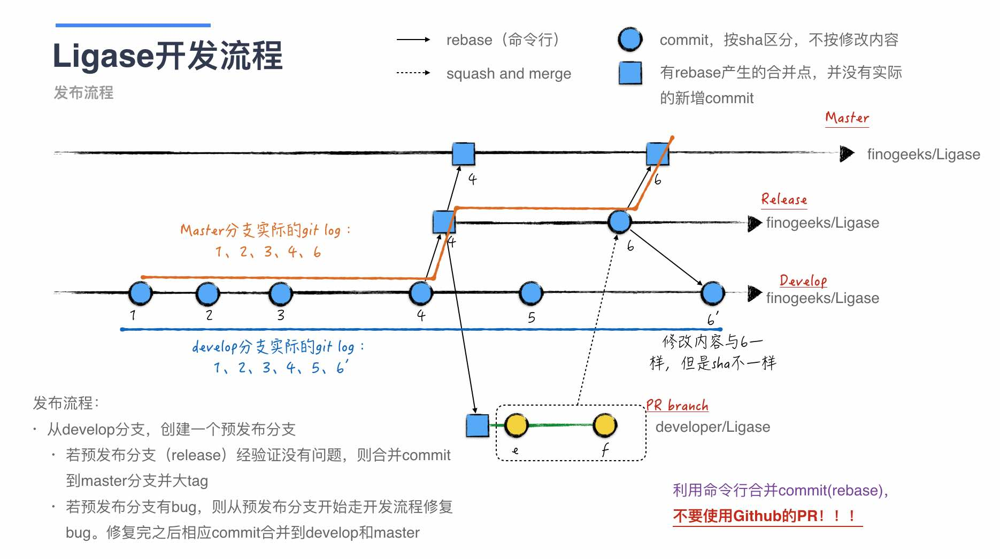

# 注意事项

这里列举的注意事项主要是为了能让Ligase的git log保持干净，也就是所谓的保持线性。比如运行`git log --graph`，能得到如下的结果

为了达到这个结果，我们使用[`Rebasing/Cherry-Picking Workflow`](https://git-scm.com/book/en/v2/Distributed-Git-Maintaining-a-Project)来管理Ligase，需要在开发和发布中注意如下的事项

## 开发中的注意实现

开发的流程图如下，其中特别值得注意的是

* 在push代码之前，一定要`git rebase upstream/develop`
* 在合并PR的时候，**一定要使用`squash and merge`**

由于我们使用`git rebase`来合并commit，因此在连续提交的时候（合并PR之后继续在同一分支开发，或者若干个PR前后依赖）会很容易碰到冲突，或者造成commit message混乱。解决办法如下：

* 不要提交前后依赖的PR
* 每次合并PR之后，新建分支进行新的开发

## 发布时的注意事项

由于Github的rebase行为与git的不同，[前者会生成新的sha](https://docs.github.com/en/github/collaborating-with-issues-and-pull-requests/about-pull-request-merges#rebase-and-merge-your-pull-request-commits)。因此，针对master和release分支，我们使用命令行来合并commit，而**不使用Github的PR！！！**

### 发布流程

Ligase的发布流程与`git flow`比较类似：

* 下图中，从上到下，分支的稳定性依次降低。比如master的稳定性比release_xxx更高
  * 原则上master分支不走开发流程
* 当多个分支需要做同样的修改时，比如bug fix（下图中的6）：
  * 从稳定性更高的分支（master除外）开始，走开发流程修复bug，比如下图的release
  * 代码开发并合并之后，从当前分支向其他分支同步修改（使用`git rebase或者git cherry-pick`）

## 总结

将上文总结一下，有三个点需要特别注意：

* 做开发点分支（PR分支）用完就扔
* 使用`squash and merge`来合并PR
* 使用命令行来管理master和release_xxx分支

